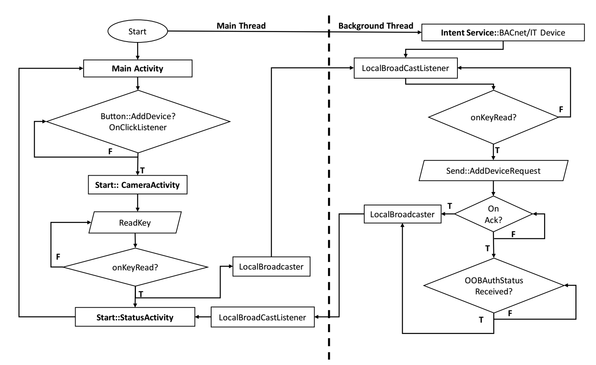
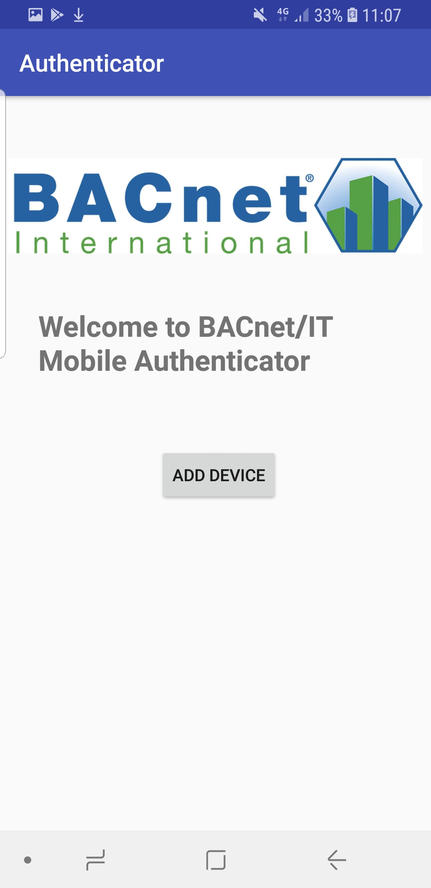
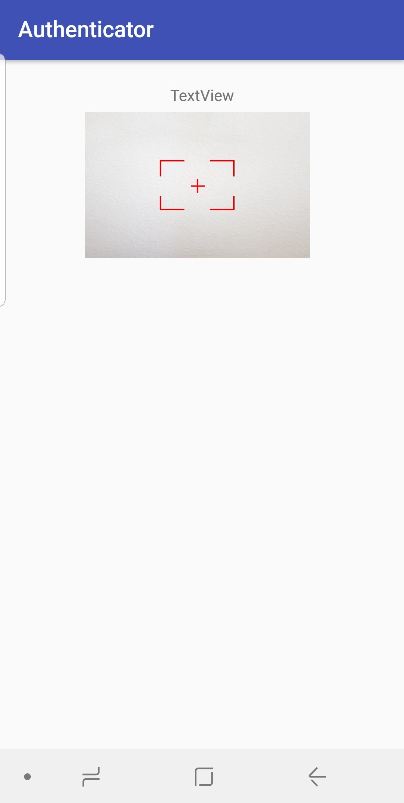

## BACnetITMobileAuthenticator

### Introduction

A simple mobile authenticator to make authenticating resource constrained devices easier in an Building Automation Network simply BACnet. This apps implements a simple out-of-band (OOB) authentication between resource cosntrained device and Bacnet/IT Directory Server (BDS) using omnipresent mobile phones.

### Out-Of-Band Channel
The camera captures LED blinks and convert it to bits.

 The Flowchart of the mobile application 

</img>

 Here is the main screen of the app: 

</img>

By clicking the Button **ADD DEVICE**, turns the back camera to capture the blinking bits from the LED.
Before pressing **ADD DEVICE** button, user should press the push button on device so the device will start blinking LED.
The mobile phone captures the OOB password in bits from the LED blink controlled by the device . The device is resource constrained, this can be a micro controller with tens of kilo bytes of storage and limited processing power.

 Camera screen that captures bits from LED blinks: 

</img>

Place the camera very close to the device <=5cm, this is also a security advanatage from evasdropping.

### Delivering password in bits to BDS server
The captured OOB password is now delivered from mobile to the server in AddDeviceRequest message, provided the server address hard coded. The mobile phone authenticates itself through CoAP-DTLS in certificate mode, This uses the demo certificates provided by [californium](https://github.com/eclipse/californium) CoAP library.
Once the device blink password is delivered to sever, server will acknowledge the mobile with a BACnet SimpleACK message for the AddDeviceRequest, user will press button on the device indicating the device to perform the elliptical curve diffie hellmann key exchange where device and sever exchange their public keys.

### Mutual Authentication
The password excanged OOB can be used for Integrity protection as well as means of authentication.
A mac key is derived from the OOB password bits and salt provided in the key exchange message by the device.
The OOB password life is limited to 360 seconds, and the authentication should occur within this time period.
The idea is to avoid PKI based certificates in resource cosntrained devices that are used in building networks.

### License
not yet decided mostly will be as Copyright 2018 University of Rostock, Institute of Applied Microelectronics and Computer Engineering.

### Acknowledgements
This work make use of code from Dr. Sebastian Unger (former Ph.D student at University of Rostock, Germany)
